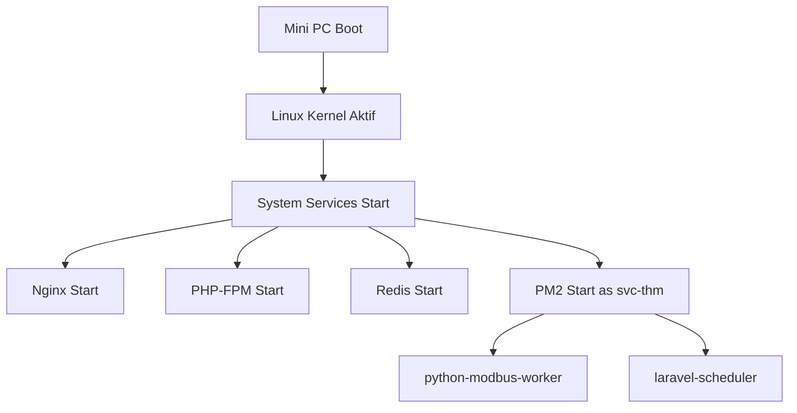
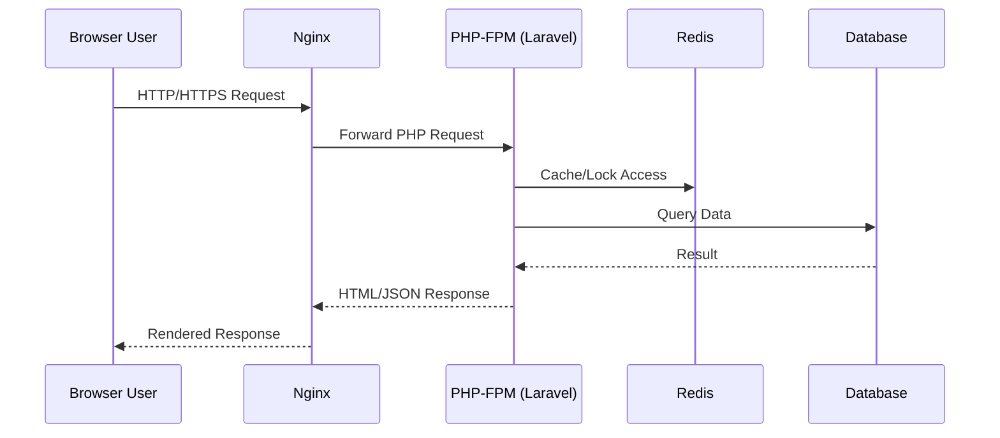
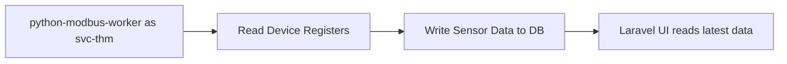
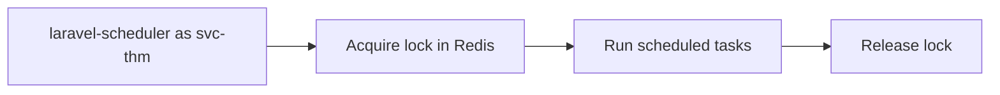

# Linux Mini PC Hardening Setup and System Flow

Dokumen ini menjelaskan setup deployment yang ketat untuk proyek Laravel + Inertia + Python worker di mini PC Linux, beserta alur sistemnya.

Fokus dokumen:

1. Menjaga agar user biasa hanya bisa memakai website dari browser.
2. Memastikan source code tidak bisa diubah oleh user biasa.
3. Menjelaskan bagaimana kernel Linux bekerja dalam arsitektur ini.

## 1) Ringkasan Konsep: "Pakai Kernel" Artinya Apa

Pada Linux, semua aplikasi selalu berjalan di atas kernel.

Alur yang benar:

1. Aplikasi (Laravel, PHP-FPM, Python worker, Nginx) berjalan di user space.
2. Aplikasi meminta resource melalui system call.
3. Kernel mengatur akses CPU, memory, disk, network, dan device.

Alur yang tidak tepat:

1. Menaruh Laravel di kernel space.
2. Menjalankan framework web sebagai modul kernel.

Kesimpulan: gunakan kernel sebagai penegak izin (permission enforcement), bukan sebagai tempat menjalankan Laravel.

## 2) Model Role yang Direkomendasikan

Gunakan minimal 3 akun Linux:

1. `deploy-admin`
2. `svc-thm` (service runtime)
3. `operator` (lokal, hanya pakai browser)

Dan user dari jaringan (browser user) tidak perlu akun Linux.

### Permission Matrix

| Entitas            | Login SSH            | Sudo          | Baca Source | Ubah Source                   | Jalankan Service     | Akses Website      |
| ------------------ | -------------------- | ------------- | ----------- | ----------------------------- | -------------------- | ------------------ |
| deploy-admin       | Ya (key only)        | Ya (terbatas) | Ya          | Ya                            | Ya (kontrol service) | Ya                 |
| svc-thm            | Tidak                | Tidak         | Ya          | Tidak (kecuali writable dirs) | Ya                   | Tidak wajib        |
| operator           | Tidak                | Tidak         | Tidak       | Tidak                         | Tidak                | Ya (browser lokal) |
| browser user (LAN) | Tidak ada akun Linux | Tidak         | Tidak       | Tidak                         | Tidak                | Ya                 |

## 3) Arsitektur Service Project

Komponen runtime utama:

1. Web server (`nginx`) menerima request HTTP/HTTPS.
2. `php-fpm` menjalankan Laravel backend.
3. `python-modbus-worker` membaca data device/sensor.
4. `laravel-scheduler` menjalankan task periodik.
5. `redis` untuk cache/lock/scheduler mutex.
6. Database (PostgreSQL/MySQL sesuai environment).

Catatan: saat ini proyek memiliki `ecosystem.config.cjs` yang menjalankan `artisan serve`. Untuk production hardening, disarankan migrasi ke `nginx + php-fpm`.

## 4) Struktur Folder dan Ownership

Contoh lokasi aplikasi:

```bash
APP_DIR=/home/edutic/temperature-humidity-monitor
```

Prinsip permission:

1. Source code read-only untuk service runtime.
2. Hanya folder berikut yang writable:
    - `storage/`
    - `bootstrap/cache/`

Contoh setup:

```bash
sudo groupadd appreaders
sudo usermod -aG appreaders deploy-admin
sudo usermod -aG appreaders svc-thm

sudo chown -R deploy-admin:appreaders /home/edutic/temperature-humidity-monitor

sudo find /home/edutic/temperature-humidity-monitor -type d -exec chmod 750 {} \;
sudo find /home/edutic/temperature-humidity-monitor -type f -exec chmod 640 {} \;

sudo chown -R svc-thm:appreaders /home/edutic/temperature-humidity-monitor/storage
sudo chown -R svc-thm:appreaders /home/edutic/temperature-humidity-monitor/bootstrap/cache
sudo chmod -R 770 /home/edutic/temperature-humidity-monitor/storage
sudo chmod -R 770 /home/edutic/temperature-humidity-monitor/bootstrap/cache
```

## 5) Setup Hardening Step-by-Step

### Step 0 - Preflight

1. Backup database.
2. Backup folder aplikasi.
3. Pastikan ada akses fisik/console sebelum mengunci SSH.

### Step 1 - Buat User dan Group

```bash
sudo adduser deploy-admin
sudo adduser --system --home /home/svc-thm --group svc-thm
sudo adduser operator

sudo usermod -aG sudo deploy-admin
sudo passwd -l svc-thm
```

Opsional untuk operator kiosk:

```bash
sudo usermod -s /usr/sbin/nologin operator
```

### Step 2 - Kunci SSH

Edit `/etc/ssh/sshd_config`:

```text
PermitRootLogin no
PasswordAuthentication no
PubkeyAuthentication yes
AllowUsers deploy-admin
```

Lalu restart SSH:

```bash
sudo systemctl restart ssh
```

### Step 3 - Firewall Minimum Exposure

```bash
sudo ufw default deny incoming
sudo ufw default allow outgoing

sudo ufw allow from <IP_ADMIN>/32 to any port 22 proto tcp
sudo ufw allow 80/tcp
sudo ufw allow 443/tcp

sudo ufw enable
sudo ufw status verbose
```

### Step 4 - Jalankan Runtime sebagai Service User

Semua process aplikasi harus berjalan sebagai `svc-thm`, bukan root.

Jika tetap memakai PM2 untuk worker/scheduler:

```bash
sudo -u svc-thm -H pm2 startOrReload /home/edutic/temperature-humidity-monitor/ecosystem.config.cjs --update-env
sudo -u svc-thm -H pm2 save
sudo pm2 startup systemd -u svc-thm --hp /home/svc-thm
```

### Step 5 - Migrasi Web Runtime ke Nginx + PHP-FPM (Recommended)

1. Gunakan Nginx untuk terminasi HTTP/HTTPS.
2. Gunakan PHP-FPM untuk eksekusi Laravel.
3. Hentikan pemakaian `php artisan serve` di production.

Contoh minimum Nginx server block:

```nginx
server {
    listen 80;
    server_name _;

    root /home/edutic/temperature-humidity-monitor/public;
    index index.php;

    location / {
        try_files $uri $uri/ /index.php?$query_string;
    }

    location ~ \.php$ {
        include snippets/fastcgi-php.conf;
        fastcgi_pass unix:/run/php/php8.3-fpm.sock;
    }

    location ~ /\. {
        deny all;
    }
}
```

### Step 6 - Lindungi Secrets

```bash
sudo chown deploy-admin:appreaders /home/edutic/temperature-humidity-monitor/.env
sudo chmod 640 /home/edutic/temperature-humidity-monitor/.env
```

Jangan menaruh rahasia di source code. Semua kredensial wajib dari `.env`.

### Step 7 - Integrity Monitoring dan Audit

Install baseline tools:

```bash
sudo apt update
sudo apt install -y aide auditd fail2ban unattended-upgrades
```

Inisialisasi AIDE:

```bash
sudo aideinit
```

### Step 8 - Hardening Fisik

1. Set BIOS/UEFI password.
2. Disable boot from USB.
3. Aktifkan secure boot.
4. Gunakan full disk encryption (jika memungkinkan).

## 6) Alur Sistem End-to-End

### A) Alur Boot dan Runtime



### B) Alur Request Website



### C) Alur Polling Sensor



### D) Alur Scheduler



## 7) Alur Deploy yang Aman

Deploy dilakukan hanya oleh `deploy-admin`.

Contoh alur:

1. Login SSH dengan key.
2. Jalankan deploy script.
3. Script build asset + refresh cache + reload PM2.
4. Verifikasi scheduler dan worker.

Contoh command:

```bash
cd /home/edutic/temperature-humidity-monitor
chmod +x scripts/deploy-production.sh
APP_DIR=/home/edutic/temperature-humidity-monitor ./scripts/deploy-production.sh
```

Catatan penguatan:

1. Idealnya deploy dari artifact CI/CD yang signed, bukan `git pull` langsung di produksi.
2. Runtime tetap dijalankan oleh `svc-thm`.

## 8) Verifikasi Permission (Wajib)

Jalankan tes ini untuk membuktikan pemisahan akses benar-benar bekerja:

```bash
sudo -u operator ls /home/edutic/temperature-humidity-monitor
sudo -u svc-thm touch /home/edutic/temperature-humidity-monitor/app/test-write.txt
sudo -u svc-thm touch /home/edutic/temperature-humidity-monitor/storage/test-write.txt
```

Ekspektasi:

1. `operator` gagal baca folder source.
2. `svc-thm` gagal menulis ke source.
3. `svc-thm` berhasil menulis ke `storage/`.

## 9) Batasan Keamanan yang Harus Dipahami

Meskipun setup sudah ketat, ada batasan fundamental:

1. Jika attacker mendapat root + akses fisik, source masih berpotensi diambil.
2. Frontend bundle (`js/css`) tetap bisa diambil dari browser (karena memang harus dikirim ke client).
3. Tujuan realistis hardening adalah membuat akses tidak sah sangat sulit, terdeteksi cepat, dan mudah dipulihkan.

## 10) SOP Operasional Harian

1. Gunakan akun `deploy-admin` untuk perubahan sistem/deploy.
2. Jangan login root langsung.
3. Rotasi SSH key secara berkala.
4. Review log `auth.log`, `nginx`, `laravel`, `pm2`.
5. Jalankan update keamanan OS terjadwal.
6. Uji restore backup secara berkala.

## 11) Checklist Go-Live

- [ ] SSH password login nonaktif.
- [ ] Root login via SSH nonaktif.
- [ ] Firewall default deny incoming.
- [ ] Service runtime berjalan sebagai `svc-thm`.
- [ ] Source read-only untuk non-admin.
- [ ] `storage/` dan `bootstrap/cache/` writable untuk runtime.
- [ ] Redis aktif dan lock scheduler normal.
- [ ] Nginx + PHP-FPM aktif untuk production.
- [ ] Monitoring integritas file aktif.
- [ ] Backup dan restore tervalidasi.

---

Jika dokumen ini diterapkan konsisten, maka model 2 pihak (admin vs user biasa) akan berjalan sesuai harapan: admin mengelola sistem, user biasa hanya memakai website, dan kernel Linux menegakkan semua batas aksesnya.
